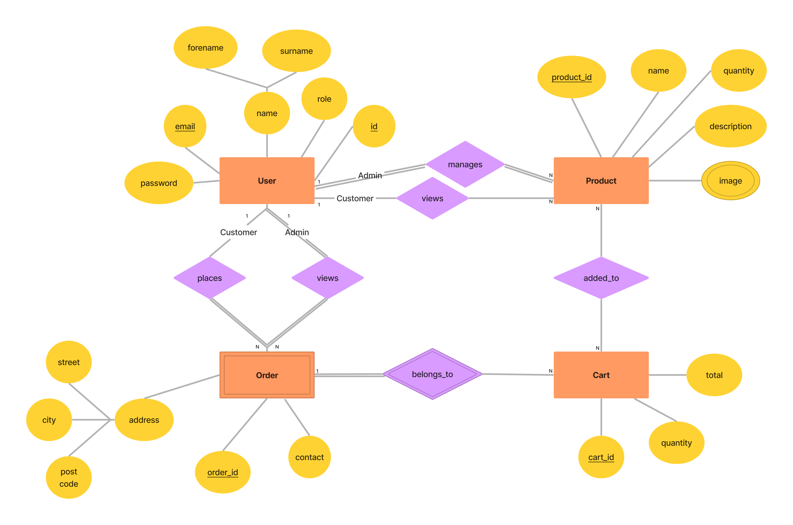

# Backend and Frontend Template

Latest version: https://git.ita.chalmers.se/courses/dit341/group-00-web (public Github [mirror](https://github.com/dit341/group-00-web))

## Project Structure

| File        | Purpose           | What you do?  |
| ------------- | ------------- | ----- |
| `server/` | Backend server code | All your server code |
| [server/README.md](server/README.md) | Everything about the server | **READ ME** carefully! |
| `client/` | Frontend client code | All your client code |
| [client/README.md](client/README.md) | Everything about the client | **READ ME** carefully! |
| [docs/DEPLOYMENT.md](docs/DEPLOYMENT.md) | Free online production deployment | Deploy your app online in production mode |
| [docs/LOCAL_DEPLOYMENT.md](docs/LOCAL_DEPLOYMENT.md) | Local production deployment | Deploy your app local in production mode |

## Requirements

The version numbers in brackets indicate the tested versions but feel free to use more recent versions.
You can also use alternative tools if you know how to configure them (e.g., Firefox instead of Chrome).

* [Git](https://git-scm.com/) (v2) => [installation instructions](https://www.atlassian.com/git/tutorials/install-git)
  * [Add your Git username and set your email](https://docs.gitlab.com/ce/gitlab-basics/start-using-git.html#add-your-git-username-and-set-your-email)
    * `git config --global user.name "YOUR_USERNAME"` => check `git config --global user.name`
    * `git config --global user.email "email@example.com"` => check `git config --global user.email`
  * > **Windows users**: We recommend to use the [Git Bash](https://www.atlassian.com/git/tutorials/git-bash) shell from your Git installation or the Bash shell from the [Windows Subsystem for Linux](https://docs.microsoft.com/en-us/windows/wsl/install-win10) to run all shell commands for this project.
* [Chalmers GitLab](https://git.ita.chalmers.se/) => Login with your **Chalmers CID** choosing "Sign in with" **Chalmers Login**. (contact [support@chalmers.se](mailto:support@chalmers.se) if you don't have one)
  * DIT341 course group: https://git.ita.chalmers.se/courses/dit341
  * [Setup SSH key with Gitlab](https://docs.gitlab.com/ee/ssh/)
    * Create an SSH key pair `ssh-keygen -t ed25519 -C "email@example.com"` (skip if you already have one)
    * Add your public SSH key to your Gitlab profile under https://git.ita.chalmers.se/profile/keys
    * Make sure the email you use to commit is registered under https://git.ita.chalmers.se/profile/emails
  * Checkout the [Backend-Frontend](https://git.ita.chalmers.se/courses/dit341/group-00-web) template `git clone git@git.ita.chalmers.se:courses/dit341/group-00-web.git`
* [Server Requirements](./server/README.md#Requirements)
* [Client Requirements](./client/README.md#Requirements)

## Getting started

```bash
# Clone repository
git clone git@git.ita.chalmers.se:courses/dit341/group-00-web.git

# Change into the directory
cd group-00-web

# Setup backend
cd server && npm install
npm run dev

# Setup frontend
cd client && npm install
npm run serve
```

> Check out the detailed instructions for [backend](./server/README.md) and [frontend](./client/README.md).

## Visual Studio Code (VSCode)

Open the `server` and `client` in separate VSCode workspaces or open the combined [backend-frontend.code-workspace](./backend-frontend.code-workspace). Otherwise, workspace-specific settings don't work properly.

## System Definition (MS0)

### Purpose

Grounds is an e-commerce website that allows people to buy and sell products over the internet, rather than at brick-and-mortar locations. In today's post-COVID19 era, more and more customers are accustomed to making purchases from the tips of their fingers in the comfort of their own home, and Grounds is the perfect online platform for these prospective customers to shop for all their coffee needs. Through this web app, business administrators can also easily update their item catalog, process customer orders, accept payments, and gather necessary data from customers to streamline the logistics of fulfilling orders.

### Pages

* Home Page: a landing page that will feature a hero section that will “quick-add” a kit of items to cart. Beneath the hero section will also be section of featured products, and beneath that will be a section for marketing blurb.
* About Page: an about page that describes to the reader the enterprise’s operations. The about page will go in depth regarding the company’s mission and values, which would serve as a marketing tool to entice potential customers to support the business. Implemented properly, this page could boost publicity coupled with SEO.
* Authentication Page: a sign-up/ login page to properly authenticate a user. Customers will have to be logged-in to place an order, and admins must have the necessary permissions to manage and update items in the product catalog. Creation of admin accounts will be out of the scope of this project under the assumption it is done by company management, and instead we will be using predefined admin accounts. Customer accounts, on the other hand, will be made and updated as necessary.
* Catalog Page: a page containing all the products in the shop’s inventory.
* Item Page/ Modal: a page/ modal that goes into detail about the item, with images and a description available. The price will be listed along with its name. A customer is able to add items to cart with this page, but an admin is able to update item information with this page.
* Cart Page: a page that lists items that the customer has added to their cart, the quantity of each item in the cart, as well as the sum total of all items.
* Checkout Page: a page that renders an order summary to screen, along with a form that will take in all necessary input to complete the order.
* Order Confirmation Page: upon successful order placement, an order summary page will be shown to the customer that renders all relevant order details to screen along with a confirmation message for that order.
* Orders Page: a page that lists all orders made, with every relevant information included. This page will be accessed exclusively by administrators.
* Order History Page: a page that lists the order history of the customer, together with relevant details of the order.

### Entity-Relationship (ER) Diagram



## Teaser (MS3)


